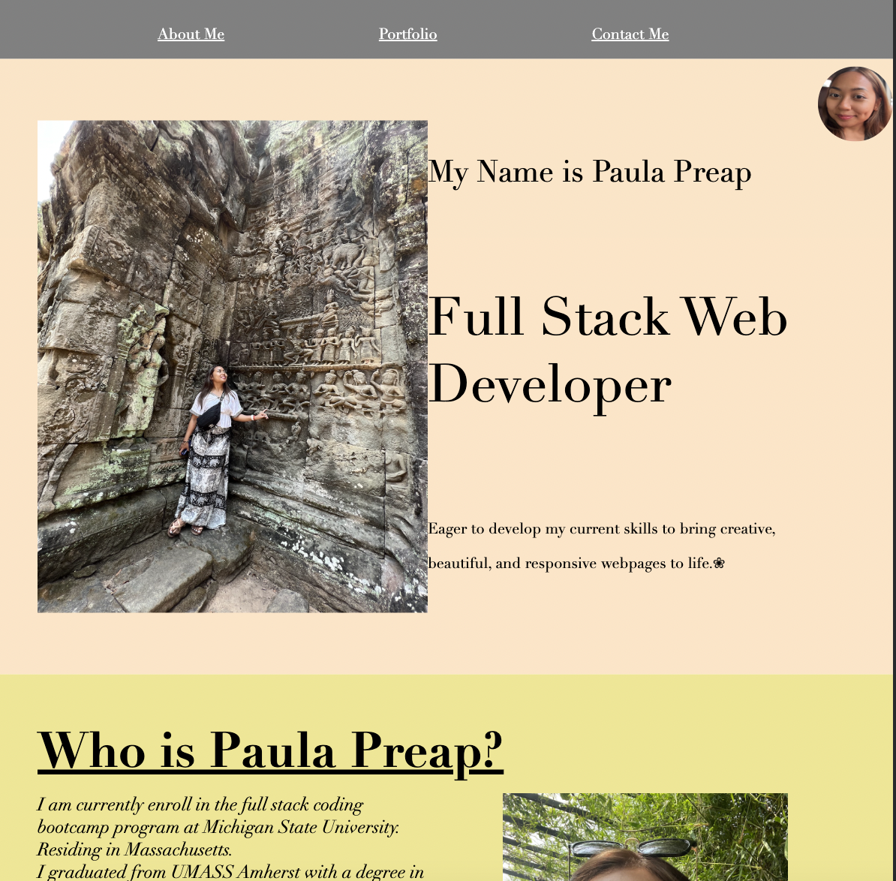
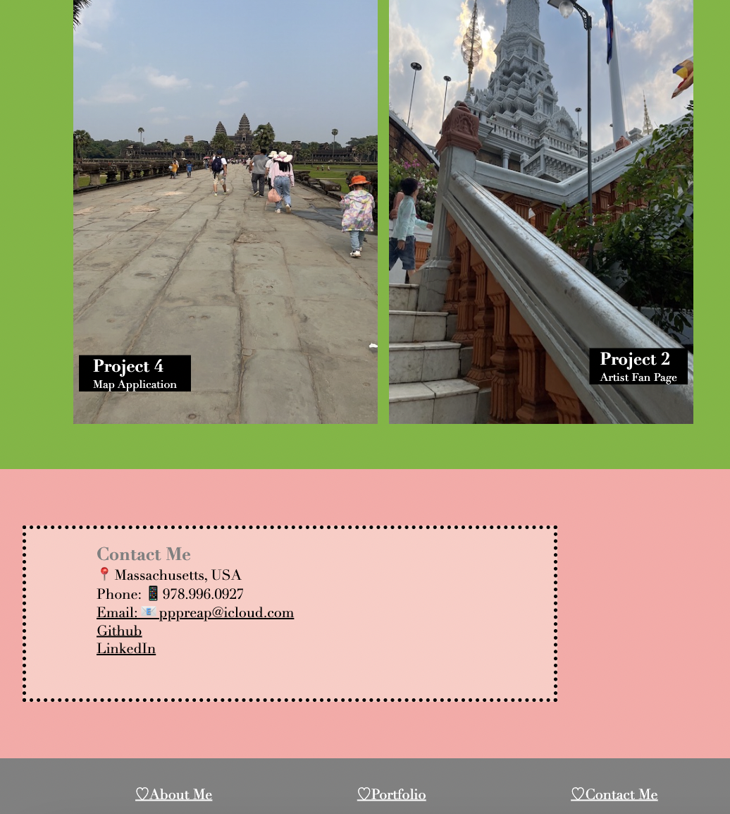

# User Story: Responsive Portfolio Page 

Potential employers  wants to view and assess my portfolio  to see if I am a good fit for a job.  
As a developer 	:woman_technologist:, I created a **responsive portfolio site** with HTML/CSS.
Application Link: (https://pppreap.github.io/hellopaula/)

## Acceptance Criteria 
WHEN the portfolio is loaded,
THEN the potential employer is presented with my name, a recent photo or avatar, and links to sections about me, my work, and how to contact me

WHEN links in the navigation is clicked,
THEN the UI scrolls to the corresponding section.

WHEN  link to the section about my work is clicked,
THEN the UI scrolls to a section with titled images of my applications.

WHEN presented with the my first application,
THEN the application's image is larger in size than the others.

WHEN the images of the applications are clicked,
THEN I am taken to that deployed application.

WHEN I resize the page or view the site on various screens and devices,
THEN I am presented with a responsive layout that adapts to my viewport.

### Assets 

These are images of the design of the portolio:

